# RUPAK VTVL — GNC System Architecture Map

| | |
|---|---|
| **Document ID** | RUPAK-ARCH-GNC-001 |
| **Revision** | Rev B |
| **Classification** | CONFIDENTIAL — PROGRAMME RESTRICTED |
| **Prepared by** | GNC Architecture Team |
| **Date** | 2025-07-01 |
| **Diagram Tool** | Mermaid.js v10+ |

---

## 1. Purpose

This document provides the normative **functional architecture visualisation** of the RUPAK GNC closed-loop system.  
The diagram below uses three clearly delineated Mermaid.js subgraphs to trace the complete signal flow from raw physical sensor measurements, through sensor fusion and state estimation, into the hierarchical GNC processing core, and finally out to all propulsion and attitude actuation effectors.

> **Rendering Note:** This diagram requires Mermaid.js v10.0 or later. Render with GitHub Markdown preview, the official Mermaid Live Editor (https://mermaid.live), or any Mermaid-compatible documentation tool (MkDocs, Docusaurus, Notion with Mermaid plugin).

---

## 2. Full GNC Closed-Loop Architecture

```mermaid
flowchart TB

    %% ─────────────────────────────────────────────────────────────────
    %% SUBGRAPH 1 — NAVIGATION SUITE / SENSOR FUSION LAYER
    %% ─────────────────────────────────────────────────────────────────
    subgraph NAV["🛰️  SUBGRAPH 1 — NAVIGATION SUITE  [Sensor Fusion Layer]"]
        direction TB

        subgraph RAW_SENSORS["Raw Sensor Inputs"]
            direction LR
            IMU["📐 IMU Cluster\n─────────────────\nBosch BMI088 × 3\n(Triple-redundant,\nvoted majority)\n─────────────────\nAccel: ±24 g @ 400 Hz\nGyro: ±2000°/s @ 400 Hz\nBias stability: 2°/hr"]

            GPS["🛰️ NavIC GNSS Receiver\n─────────────────\nL5 + S-Band, Dual-Freq\n─────────────────\nPos accuracy: <1.5 m CEP\nVel accuracy: <0.1 m/s\nUpdate rate: 10 Hz\nCold start: <35 s TTFF"]

            RADAR["📡 FMCW Radar Altimeter\n─────────────────\nFreq: 77 GHz, 4 GHz BW\n─────────────────\nRange: 0.3 m – 800 m AGL\nResolution: 3 cm\nUpdate: 200 Hz\nUsed: Final 800 m descent"]

            LIDAR["👁️ Vision / LiDAR Suite\n─────────────────\nGround-facing stereo camera\n+ MEMS solid-state LiDAR\n─────────────────\nPoint cloud: 20 Hz\nRange: 0.2 m – 150 m\nUsed: <150 m terminal\nguidance & pad detection"]
        end

        subgraph PREPROC["Signal Pre-Processing"]
            direction TB
            IMU_COMP["IMU Voter &\nBias Compensator\n(200°C thermal model)"]
            GPS_PARSE["NavIC Message\nParser & Integrity\nCheck (RAIM)"]
            RADAR_PROC["Altimeter FFT\nProcessor\n(Doppler velocity\nextraction)"]
            LIDAR_PROC["Point Cloud\nSegmentation &\nLanding Pad\nFeature Extractor"]
        end

        subgraph ESKF_BLOCK["Error-State Kalman Filter  [ESKF]"]
            direction TB
            ESKF_PRED["── PREDICTION STEP ──\nPropagate nominal state\nusing IMU kinematics\nState: x̂ ∈ ℝ¹⁵\n[pos(3), vel(3), att(3),\ngyro_bias(3), acc_bias(3)]\nCovariance: P ∈ ℝ¹⁵ˣ¹⁵\nRate: 400 Hz (IMU-locked)"]

            ESKF_UPD_GPS["── GPS UPDATE (Async) ──\nObservation: δz_GPS\n= [pos, vel]ᵀ\nH_GPS ∈ ℝ⁶ˣ¹⁵\nKalman Gain: K_GPS\nRate: 10 Hz\n(GNSS-locked)"]

            ESKF_UPD_ALT["── ALTIMETER UPDATE ──\nObservation: δz_alt\n= [h_AGL, ḣ_AGL]ᵀ\nH_alt ∈ ℝ²ˣ¹⁵\nActive: h < 800 m AGL\nRate: 200 Hz"]

            ESKF_UPD_VIS["── VISION UPDATE ──\nObservation: δz_vis\n= [rel_pos(3)]ᵀ\nActive: h < 150 m AGL\nRate: 20 Hz"]

            ESKF_RESET["── RESET STEP ──\nInject δx̂ into\nnominal state x̄\nReset error state δx̂ = 0\nPreserve covariance P"]

            ESKF_OUTPUT["── STATE OUTPUT ──\nFused navigation state:\npos_ecef (3), vel_ned (3),\nq_body_to_ned (4-quat),\nbias_gyro (3), bias_acc (3)\nOutput Rate: 400 Hz"]
        end

        IMU --> IMU_COMP
        GPS --> GPS_PARSE
        RADAR --> RADAR_PROC
        LIDAR --> LIDAR_PROC

        IMU_COMP -->|"δf, δω @ 400 Hz"| ESKF_PRED
        GPS_PARSE -->|"GNSS fix @ 10 Hz\n[lat, lon, h, vN, vE, vD]"| ESKF_UPD_GPS
        RADAR_PROC -->|"h_AGL, ḣ @ 200 Hz"| ESKF_UPD_ALT
        LIDAR_PROC -->|"rel_pos ∈ ℝ³ @ 20 Hz"| ESKF_UPD_VIS

        ESKF_PRED --> ESKF_UPD_GPS
        ESKF_PRED --> ESKF_UPD_ALT
        ESKF_PRED --> ESKF_UPD_VIS
        ESKF_UPD_GPS --> ESKF_RESET
        ESKF_UPD_ALT --> ESKF_RESET
        ESKF_UPD_VIS --> ESKF_RESET
        ESKF_RESET --> ESKF_OUTPUT
    end

    %% ─────────────────────────────────────────────────────────────────
    %% SUBGRAPH 2 — GNC PROCESSING CORE
    %% ─────────────────────────────────────────────────────────────────
    subgraph GNC_CORE["⚙️  SUBGRAPH 2 — GNC PROCESSING CORE  [Hierarchical Control]"]
        direction TB

        subgraph OUTER_LOOP["Outer Guidance Loop  [10 Hz]"]
            direction LR
            TRAJ_GEN["Trajectory Generator\n─────────────────\nPre-loaded 6DOF\nreference trajectory\n(pos_ref, vel_ref, mass_ref)\nFlight phase manager:\nAscent / Coast / Boostback /\nEntry / Landing Burn"]

            GUID_LAW["Guidance Law\n─────────────────\nZero-Effort-Miss (ZEM/ZEV)\ngravity-turn + PEG blending\nOutput: a_cmd ∈ ℝ³ [m/s²]\nThrust magnitude: F_cmd [N]\nThrott_master: NTC ∈ [0.1, 1.1]"]

            POS_ERR["Position & Velocity\nError Computation\nΔpos = pos_ref − pos_est\nΔvel = vel_ref − vel_est\nError-state fed to\nguidance law"]
        end

        subgraph ATT_LOOP["Attitude Control Loop  [100 Hz]"]
            direction LR
            ATT_CMD["Attitude Command\nComputer\n─────────────────\nConvert a_cmd → q_cmd\nQuaternion error:\nδq = q_cmd ⊗ q_est⁻¹\nAngular rate error:\nδω = ω_cmd − ω_est"]

            PD_CTRL["PD + Feed-Forward\nAttitude Controller\n─────────────────\nτ_cmd = Kp·δq[1:3]\n       + Kd·δω\n       + J·α_ff\nGains: Kp = diag(45,45,12)\n       Kd = diag(180,180,60)\n       [N·m / rad, N·m·s / rad]"]

            RATE_LIMIT["Rate & Accel\nLimiter\nmax ω: 15°/s per axis\nmax α: 8°/s² per axis\nAnti-windup integrator\nclamping"]
        end

        subgraph MIXING["Actuator Mixing Matrix  [400 Hz]"]
            direction TB
            MIXING_CORE["Allocation Matrix  B ∈ ℝ⁶ˣⁿ\n─────────────────\nInput: [τ_pitch, τ_yaw, τ_roll,\n        F_x, F_y, F_z]ᵀ\nOutput: n effector commands\n─────────────────\nPseudo-inverse solution:\nδu = Bᵀ(BBᵀ)⁻¹ · τ_cmd\nWith throttle saturation\nconstraints enforced via\nweighted least-squares\n(WLS) QP solver, 400 Hz"]

            RATE_SHAPING["Command Rate Shaping\n&  Anti-Aliasing Filter\n2nd-order Butterworth,\ncutoff 80 Hz\nApplied per actuator channel"]
        end

        ESKF_OUTPUT -->|"x̂_nav @ 400 Hz\n[pos, vel, q, biases]"| POS_ERR
        POS_ERR --> GUID_LAW
        TRAJ_GEN -->|"ref trajectory @ 10 Hz"| GUID_LAW
        GUID_LAW -->|"a_cmd, F_cmd @ 10 Hz"| ATT_CMD
        ESKF_OUTPUT -->|"q_est, ω_est @ 400 Hz"| ATT_CMD
        ATT_CMD -->|"δq, δω @ 100 Hz"| PD_CTRL
        PD_CTRL -->|"τ_cmd ∈ ℝ³ @ 100 Hz"| RATE_LIMIT
        RATE_LIMIT -->|"τ_cmd_sat @ 100 Hz"| MIXING_CORE
        GUID_LAW -->|"F_cmd, NTC_master @ 10 Hz"| MIXING_CORE
        MIXING_CORE --> RATE_SHAPING
    end

    %% ─────────────────────────────────────────────────────────────────
    %% SUBGRAPH 3 — PROPULSION ACTUATION
    %% ─────────────────────────────────────────────────────────────────
    subgraph PROP_ACT["🚀  SUBGRAPH 3 — PROPULSION ACTUATION"]
        direction TB

        subgraph TVC["Dual-Axis TVC System  [Pitch / Yaw]"]
            direction LR
            TVC_PITCH["Pitch TVC\nGimbal Ring\n─────────────────\nElectro-mechanical\nservo actuators × 2\n(Engine 5 central)\nRange: ±8° in pitch\nRate: 20°/s max\nFeedback: 12-bit LVDT\nBandwidth: 15 Hz (-3dB)"]

            TVC_YAW["Yaw TVC\nGimbal Ring\n─────────────────\nElectro-mechanical\nservo actuators × 2\n(Engine 5 central)\nRange: ±8° in yaw\nRate: 20°/s max\nFeedback: 12-bit LVDT\nBandwidth: 15 Hz (-3dB)"]
        end

        subgraph DIFF_THROT["Differential Throttle  [Roll Control]"]
            direction TB
            DIFF_ALLOC["Roll Differential\nThrottle Allocator\n─────────────────\nMaps τ_roll →\nΔNTC per engine pair\nEngine pairing (opposing):\nPair-A: Eng1 vs Eng5\nPair-B: Eng2 vs Eng6\nPair-C: Eng3 vs Eng7\nPair-D: Eng4 vs Eng8\n(Engine 9 central: roll-neutral)\nMax ΔNTC: ±5% NTC\nResolution: 0.1% NTC"]

            ENGINE_CMD["Per-Engine NTC Commands\n─────────────────\nNTC₁ … NTC₉\nRange: 10% – 110% NTC\nCommand latency via\nCAN-FD: <2 ms\nActual RPM tracking\nbandwidth: ~20 Hz\n(motor + pump inertia limited)"]
        end

        subgraph RCS["Cold Gas RCS  [Fine Attitude]"]
            direction LR
            RCS_CTRL["RCS Pulse-Width\nController\n─────────────────\nInput: residual att error\nafter TVC + diff throttle\nOutput: PWM duty cycle\nper thruster valve\n─────────────────\nThruster count: 12\n(4 clusters × 3-axis)\nMin impulse bit: 0.05 N·s\nNominal thrust: 50 N each\nPropellant: GN₂ @ 300 bar\nUsed: coast phase +\nupper atmosphere"]

            RCS_VALVE["Solenoid Valve\nDriver Array\n─────────────────\nPWM frequency: 20 Hz\nDuty range: 0% – 100%\nDrive voltage: 28 VDC\nResponse: <5 ms open/close\nFlow control: binary\n(bang-bang modulated)"]
        end

        RATE_SHAPING -->|"δ_pitch_cmd @ 400 Hz\n[deg, servo position]"| TVC_PITCH
        RATE_SHAPING -->|"δ_yaw_cmd @ 400 Hz\n[deg, servo position]"| TVC_YAW
        RATE_SHAPING -->|"τ_roll_cmd @ 400 Hz"| DIFF_ALLOC
        DIFF_ALLOC -->|"ΔNTC per engine pair"| ENGINE_CMD
        RATE_SHAPING -->|"NTC_master @ 100 Hz\n(thrust magnitude)"| ENGINE_CMD
        RATE_SHAPING -->|"residual att error\n@ 400 Hz"| RCS_CTRL
        RCS_CTRL -->|"PWM duty × 12 channels\n@ 20 Hz"| RCS_VALVE
    end

    %% ─────────────────────────────────────────────────────────────────
    %% FEEDBACK PATHS
    %% ─────────────────────────────────────────────────────────────────
    subgraph FEEDBACK["♻️  FEEDBACK — Sensor to State Estimator"]
        direction LR
        TVC_FB["TVC LVDT\nPosition Feedback\n@ 400 Hz"]
        ENG_FB["ECU Telemetry\n(RPM, chamber P,\nESC status)\n@ 100-500 Hz"]
        RCS_FB["RCS Valve\nPosition Switches\n@ 20 Hz"]
    end

    TVC_PITCH -->|"LVDT actual angle"| TVC_FB
    TVC_YAW -->|"LVDT actual angle"| TVC_FB
    ENGINE_CMD -->|"actual NTC + RPM\n(CAN-FD)"| ENG_FB
    RCS_VALVE -->|"valve state bits"| RCS_FB

    TVC_FB -->|"actuator state feedback\nto ESKF auxiliary input"| ESKF_PRED
    ENG_FB -->|"thrust model update\nto guidance F_cmd loop"| GUID_LAW
    RCS_FB -->|"RCS state to\nattitude controller"| ATT_CMD
```



---

## 3. Subgraph Summary Table

| Subgraph | Dominant Rate | Key Algorithm | Primary State Variables |
|---|---|---|---|
| Navigation Suite | 400 Hz (ESKF predict) | Error-State Kalman Filter | pos_ecef, vel_ned, q_body2ned, gyro/acc bias |
| Outer Guidance Loop | 10 Hz | Zero-Effort-Miss / PEG gravity-turn | Δpos, Δvel, a_cmd, F_cmd |
| Attitude Control Loop | 100 Hz | PD + feed-forward, quaternion error | δq, δω, τ_cmd |
| Actuator Mixing Matrix | 400 Hz | Weighted Least-Squares QP | u_effectors ∈ ℝⁿ |
| TVC Pitch/Yaw | 400 Hz cmd / 15 Hz BW | Position-servo inner loop | δ_pitch, δ_yaw |
| Differential Throttle | 100 Hz cmd / ~20 Hz BW | Linear roll allocation | ΔNTC₁…₈ |
| Cold Gas RCS | 20 Hz | Bang-bang PWM modulation | τ_rcs_12ch |

---

## 4. Control Loop Timing Budget

```
IMU sample           @ 400 Hz  → 2.50 ms period
ESKF predict step    @ 400 Hz  → 2.50 ms (must complete in <1.0 ms on GFC)
ESKF GPS update      @ 10 Hz   → 100 ms (asynchronous, non-blocking)
ESKF altimeter upd   @ 200 Hz  → 5 ms
Attitude loop        @ 100 Hz  → 10 ms  (2.50 ms compute budget)
Mixing matrix        @ 400 Hz  → 2.50 ms (0.8 ms WLS solver budget)
CAN-FD command TX    @ 100 Hz  → 10 ms  (< 0.5 ms bus arbitration + TX)
TVC servo response   @ 15 Hz BW → 66 ms (-3 dB) / 20°/s slew limit
Motor RPM response   @ ~20 Hz  → 50 ms bandwidth (inertia-limited)
RCS valve open       < 5 ms    → mechanical latency

Total GNC loop latency (IMU → TVC command): < 5 ms (verified by timing analysis)
```

---

*End of Document — RUPAK-ARCH-GNC-001 Rev B*
