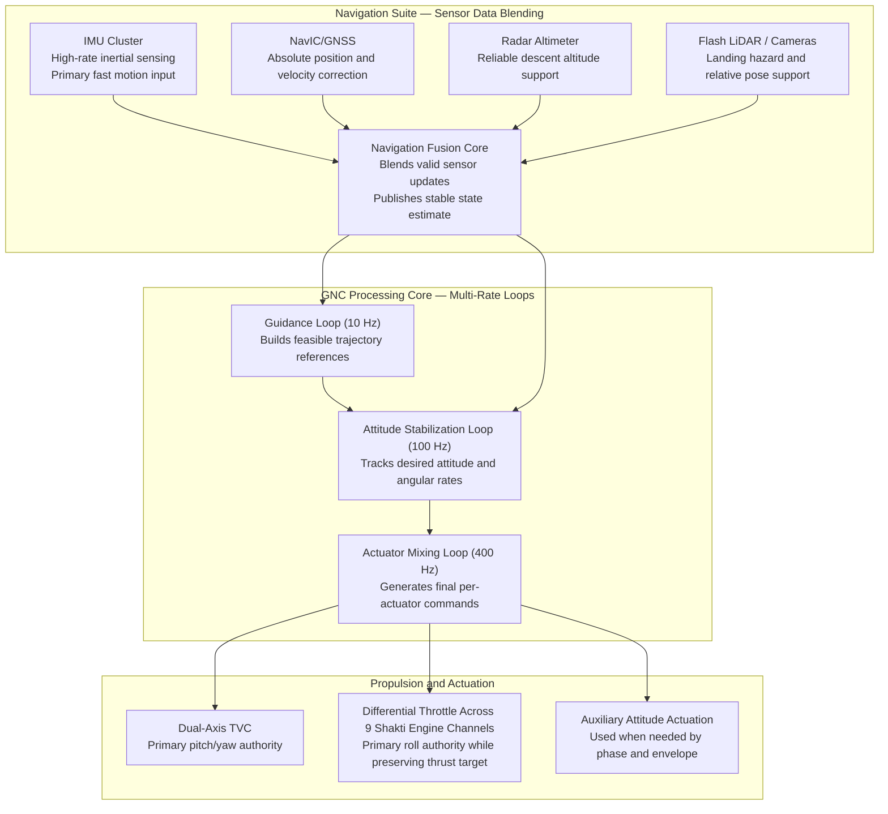

# RUPAK VTVL — GNC System Architecture Map

| | |
|---|---|
| **Document ID** | RUPAK-ARCH-GNC-001 |
| **Revision** | Rev C |
| **Classification** | CONFIDENTIAL — PROGRAMME RESTRICTED |
| **Prepared by** | GNC Architecture Team |
| **Date** | 2026-05-18 |
| **Diagram Tool** | Mermaid.js v10+ |

---

## 1. Purpose

This document presents a high-level view of the RUPAK closed-loop GNC architecture. It shows how sensor data moves through navigation and control, then into propulsion and attitude actuation.

---

## 2. Closed-Loop Architecture (Functional View)

---

## 3. Architecture Summary

| Subsystem | Primary Role | Typical Rate |
|---|---|---|
| Navigation Suite | Sensor data blending and state estimation | Up to 400 Hz internal propagation |
| Guidance Loop | Builds mission-feasible references | 10 Hz |
| Attitude Loop | Smooth attitude stabilization | 100 Hz |
| Mixing/Allocation Loop | Rapid actuator command realization with limits | 400 Hz |
| TVC Path | Pitch and yaw control | 400 Hz command path |
| Differential Throttle Path | Roll control using 9 Shakti engine channels | 100-400 Hz command participation |

---

## 4. Timing and Integration Notes

- Keep deterministic scheduling boundaries between 10 Hz, 100 Hz, and 400 Hz tasks.
- Prioritize attitude stabilization when actuator limits are reached.
- Maintain robust stale-data handling on all control-critical interfaces.
- Keep feedback closure active for TVC and propulsion telemetry for stable command tracking.

---

*End of Document — RUPAK-ARCH-GNC-001 Rev C*
